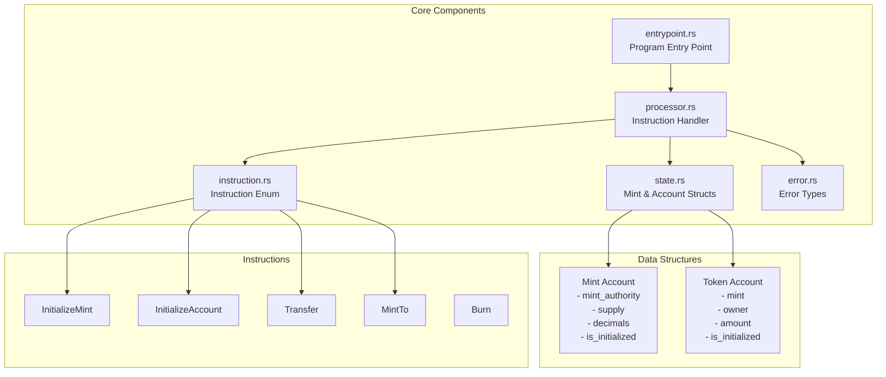

# Minimal Token Program MVP - Development Roadmap

## Overview

Build a minimal Solana token program from scratch with core ERC20-like functionality. This MVP includes essential features: mint initialization, account creation, transfers, minting, and burning.

## Architecture



---

## Milestone 1: Foundation Setup ✅

**Goal**: Establish project structure and core type definitions

**Status**: ✅ Complete

### Deliverables
- [x] Project structure with `Cargo.toml` configured
- [x] Module files created (`lib.rs`, `entrypoint.rs`, `processor.rs`, `instruction.rs`, `state.rs`, `error.rs`)
- [x] Program ID configured

### Tasks Completed
1. ✅ Created `Cargo.toml` with Solana program dependencies
2. ✅ Set up workspace structure
3. ✅ Configured program ID and build settings

### Verification
- ✅ Project compiles without errors
- ✅ All modules are properly exported

---

## Milestone 2: Error Handling & Type Definitions ✅

**Goal**: Define error types and instruction enum

**Status**: ✅ Complete

### Deliverables
- [x] Custom error enum (`TokenError`) with 8 variants
- [x] Instruction enum with 5 variants
- [x] Instruction unpacking logic

### Tasks Completed
1. ✅ Implemented error types:
   - `AlreadyInitialized`, `NotInitialized`, `InsufficientFunds`
   - `InvalidMint`, `MintMismatch`, `InvalidOwner`
   - `Overflow`, `NotRentExempt`
2. ✅ Defined instruction variants:
   - `InitializeMint { decimals, mint_authority }`
   - `InitializeAccount`
   - `Transfer { amount }`
   - `MintTo { amount }`
   - `Burn { amount }`
3. ✅ Implemented `TokenInstruction::unpack()` method

### Verification
- ✅ Error types convert to `ProgramError` correctly
- ✅ Instruction unpacking handles all variants
- ✅ Invalid instruction data returns appropriate errors

---

## Milestone 3: State Structures & Serialization ✅

**Goal**: Implement data structures with Pack trait

**Status**: ✅ Complete

### Deliverables
- [x] `Mint` struct (82 bytes) with Pack implementation
- [x] `Account` struct (165 bytes) with Pack implementation
- [x] Serialization/deserialization working correctly

### Tasks Completed
1. ✅ Implemented `Mint` struct:
   - `mint_authority: Pubkey` (32 bytes)
   - `supply: u64` (8 bytes)
   - `decimals: u8` (1 byte)
   - `is_initialized: bool` (1 byte)
   - Padding to 82 bytes total
2. ✅ Implemented `Account` struct:
   - `mint: Pubkey` (32 bytes)
   - `owner: Pubkey` (32 bytes)
   - `amount: u64` (8 bytes)
   - `is_initialized: bool` (1 byte)
   - Padding to 165 bytes total
3. ✅ Implemented `Pack` trait for both structs
4. ✅ Implemented `IsInitialized` trait

### Verification
- ✅ Pack/unpack round-trip preserves data
- ✅ Account sizes match expected lengths
- ✅ Initialization state tracked correctly

---

## Milestone 4: Core Instruction Handlers ✅

**Goal**: Implement all instruction processing logic

**Status**: ✅ Complete

### Deliverables
- [x] `process_initialize_mint` handler
- [x] `process_initialize_account` handler
- [x] `process_transfer` handler
- [x] `process_mint_to` handler
- [x] `process_burn` handler
- [x] Main `process` router

### Tasks Completed
1. ✅ **InitializeMint**:
   - Validates uninitialized state
   - Checks rent exemption
   - Sets mint authority, decimals, supply=0
   - Marks as initialized
2. ✅ **InitializeAccount**:
   - Validates uninitialized state
   - Checks rent exemption
   - Verifies mint account validity
   - Sets mint, owner, amount=0
   - Marks as initialized
3. ✅ **Transfer**:
   - Validates both accounts initialized
   - Checks sufficient balance
   - Verifies mint match
   - Validates owner signature
   - Updates balances with checked arithmetic
4. ✅ **MintTo**:
   - Validates mint authority signature
   - Verifies account matches mint
   - Updates supply and balance
5. ✅ **Burn**:
   - Validates owner signature
   - Checks sufficient balance
   - Verifies mint match
   - Decreases supply and balance

### Verification
- ✅ All handlers compile without errors
- ✅ Security checks in place (signatures, ownership, overflow protection)
- ✅ Error handling covers edge cases

---

## Milestone 5: Entry Point & Integration ✅

**Goal**: Wire up program entry point and exports

**Status**: ✅ Complete

### Deliverables
- [x] Entry point configured with `solana-program-entrypoint`
- [x] Error logging implemented
- [x] Library exports configured
- [x] Program ID exported

### Tasks Completed
1. ✅ Entry point routes to `Processor::process()`
2. ✅ Error handling with logging
3. ✅ Module exports in `lib.rs`
4. ✅ Utility functions exported (`check_id`, `check_program_account`)

### Verification
- ✅ Program compiles as Solana program
- ✅ Entry point macro configured correctly
- ✅ All public APIs exported

---

## Milestone 6: Unit Testing 🎯

**Goal**: Comprehensive test coverage for all instructions

**Status**: 🚧 In Progress

### Deliverables
- [ ] Unit tests for `Mint` pack/unpack
- [ ] Unit tests for `Account` pack/unpack
- [ ] Unit tests for instruction unpacking
- [ ] Unit tests for each instruction handler
- [ ] Edge case tests

### Tasks to Complete

#### 6.1 State Structure Tests
- [ ] Test `Mint::pack()` and `Mint::unpack()`
- [ ] Test `Account::pack()` and `Account::unpack()`
- [ ] Test initialization state tracking
- [ ] Test invalid data handling

#### 6.2 Instruction Tests
- [ ] Test `InitializeMint` unpacking
- [ ] Test `InitializeAccount` unpacking
- [ ] Test `Transfer` unpacking
- [ ] Test `MintTo` unpacking
- [ ] Test `Burn` unpacking
- [ ] Test invalid instruction handling

#### 6.3 Processor Tests
- [ ] **InitializeMint**:
  - [ ] Success case
  - [ ] Already initialized error
  - [ ] Not rent exempt error
- [ ] **InitializeAccount**:
  - [ ] Success case
  - [ ] Already initialized error
  - [ ] Invalid mint error
  - [ ] Not rent exempt error
- [ ] **Transfer**:
  - [ ] Success case
  - [ ] Insufficient funds error
  - [ ] Mint mismatch error
  - [ ] Invalid owner error
  - [ ] Self-transfer (no-op)
- [ ] **MintTo**:
  - [ ] Success case
  - [ ] Invalid mint authority error
  - [ ] Mint mismatch error
  - [ ] Overflow protection
- [ ] **Burn**:
  - [ ] Success case
  - [ ] Insufficient funds error
  - [ ] Invalid owner error
  - [ ] Mint mismatch error
  - [ ] Overflow protection

### Testing Tools
- Use `mollusk-svm` for Solana program testing
- Use `solana-account` for account mocking
- Test with various account states and edge cases

---

## Milestone 7: Integration Testing 🎯

**Goal**: End-to-end testing with local validator

**Status**: 📋 Planned

### Deliverables
- [ ] Integration test suite
- [ ] Test scenarios covering full workflows
- [ ] Performance benchmarks

### Tasks to Complete

#### 7.1 Setup Integration Tests
- [ ] Configure local validator
- [ ] Set up test fixtures
- [ ] Create helper utilities

#### 7.2 Test Scenarios
- [ ] **Full Token Lifecycle**:
  1. Create mint
  2. Create token accounts (multiple)
  3. Mint tokens to account A
  4. Transfer from A to B
  5. Burn from B
  6. Verify final balances
- [ ] **Multi-Account Transfers**:
  - [ ] Chain transfers (A → B → C)
  - [ ] Multiple simultaneous transfers
- [ ] **Edge Cases**:
  - [ ] Zero amount transfers
  - [ ] Maximum u64 amounts
  - [ ] Concurrent operations

#### 7.3 Performance Testing
- [ ] Measure compute units per instruction
- [ ] Test with maximum account sizes
- [ ] Benchmark serialization/deserialization

---

## Milestone 8: Documentation & Examples 📋

**Goal**: Comprehensive documentation for users

**Status**: 📋 Planned

### Deliverables
- [ ] API documentation
- [ ] Usage examples
- [ ] Architecture documentation
- [ ] Deployment guide

### Tasks to Complete

#### 8.1 Code Documentation
- [ ] Document all public functions
- [ ] Add examples to doc comments
- [ ] Document error conditions
- [ ] Add architecture diagrams

#### 8.2 Usage Examples
- [ ] Example: Creating a mint
- [ ] Example: Creating token accounts
- [ ] Example: Transferring tokens
- [ ] Example: Minting tokens
- [ ] Example: Burning tokens

#### 8.3 Deployment Guide
- [ ] Build instructions
- [ ] Deployment steps
- [ ] Program ID configuration
- [ ] Testing on devnet/mainnet

---

## Milestone 9: Security Audit 🔒

**Goal**: Security review and hardening

**Status**: 📋 Planned

### Deliverables
- [ ] Security audit checklist
- [ ] Vulnerability assessment
- [ ] Fixes for identified issues

### Tasks to Complete

#### 9.1 Security Checklist
- [ ] All signatures validated
- [ ] All account ownership verified
- [ ] Overflow protection on all arithmetic
- [ ] Rent exemption checks
- [ ] Initialization state validation
- [ ] Mint matching validation

#### 9.2 Common Vulnerabilities
- [ ] Reentrancy protection (not applicable for Solana)
- [ ] Integer overflow/underflow
- [ ] Access control bypass
- [ ] Account validation bypass
- [ ] Signature verification bypass

#### 9.3 Code Review
- [ ] Peer review of all handlers
- [ ] Review error handling paths
- [ ] Review edge cases

---

## Milestone 10: Optimization & Refinement 🚀

**Goal**: Performance optimization and code quality

**Status**: 📋 Planned

### Deliverables
- [ ] Performance optimizations
- [ ] Code quality improvements
- [ ] Refactoring if needed

### Tasks to Complete

#### 10.1 Performance
- [ ] Minimize compute units
- [ ] Optimize serialization
- [ ] Reduce account reads/writes where possible
- [ ] Profile hot paths

#### 10.2 Code Quality
- [ ] Apply clippy suggestions
- [ ] Format code consistently
- [ ] Improve error messages
- [ ] Add more detailed logging

---

## Key Design Decisions

1. **Account Model**: Follow Solana's account model - each mint and token account is a separate on-chain account
2. **Serialization**: Use `Pack` trait for efficient byte-level serialization
3. **Validation**: Always validate account ownership, initialization state, and rent exemption
4. **Security**: Check all signatures, validate account ownership, prevent overflow with checked arithmetic
5. **Simplicity**: Skip advanced features (approvals, freezing, multisig) for MVP

---

## File Structure

```
program/
├── Cargo.toml
├── src/
│   ├── lib.rs           # Module exports, program ID
│   ├── entrypoint.rs    # Program entry point
│   ├── processor.rs     # Instruction processing logic
│   ├── instruction.rs   # Instruction enum and deserialization
│   ├── state.rs         # Mint and Account structs with Pack impl
│   └── error.rs         # Custom error types
└── tests/
    └── processor.rs     # Unit tests
```

---

## Dependencies

- `solana-program` crates for core functionality
- `solana-program-pack` for serialization
- `thiserror` for error handling
- `arrayref` for safe array manipulation
- `mollusk-svm` for testing (dev dependency)

---

## Progress Summary

- ✅ **Milestone 1**: Foundation Setup - Complete
- ✅ **Milestone 2**: Error Handling & Type Definitions - Complete
- ✅ **Milestone 3**: State Structures & Serialization - Complete
- ✅ **Milestone 4**: Core Instruction Handlers - Complete
- ✅ **Milestone 5**: Entry Point & Integration - Complete
- 🎯 **Milestone 6**: Unit Testing - In Progress
- 📋 **Milestone 7**: Integration Testing - Planned
- 📋 **Milestone 8**: Documentation & Examples - Planned
- 📋 **Milestone 9**: Security Audit - Planned
- 📋 **Milestone 10**: Optimization & Refinement - Planned

**Overall Progress**: 50% Complete (5/10 milestones)

---

## Next Steps

1. **Immediate**: Start implementing unit tests (Milestone 6)
2. **Short-term**: Complete integration testing (Milestone 7)
3. **Medium-term**: Write documentation and examples (Milestone 8)
4. **Long-term**: Security audit and optimization (Milestones 9-10)
