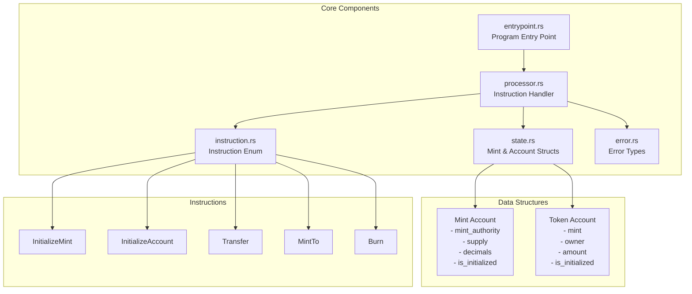

# Minimal Token Program MVP Implementation Plan

## Overview

Build a minimal Solana token program from scratch with core ERC20-like functionality. This MVP will include only essential features: mint initialization, account creation, transfers, minting, and burning.

## Architecture



## Implementation Steps

### 1. Project Setup

- Create `Cargo.toml` with Solana program dependencies
- Set up workspace structure: `src/lib.rs`, `src/entrypoint.rs`, `src/processor.rs`, `src/instruction.rs`, `src/state.rs`, `src/error.rs`
- Configure program ID and build settings

### 2. Error Types (`src/error.rs`)

Define custom error enum with variants:

- `AlreadyInitialized` - Account/mint already initialized
- `NotInitialized` - Account/mint not initialized
- `InsufficientFunds` - Not enough tokens for operation
- `InvalidMint` - Mint account validation failed
- `MintMismatch` - Token account doesn't match mint
- `InvalidOwner` - Owner validation failed
- `Overflow` - Arithmetic overflow
- `NotRentExempt` - Account not rent-exempt

### 3. State Structures (`src/state.rs`)

Implement two core data structures:

**Mint Account** (82 bytes):

- `mint_authority: Pubkey` (32 bytes) - Who can mint tokens
- `supply: u64` (8 bytes) - Total supply
- `decimals: u8` (1 byte) - Decimal places
- `is_initialized: bool` (1 byte) - Initialization flag
- Padding to 82 bytes

**Token Account** (165 bytes):

- `mint: Pubkey` (32 bytes) - Associated mint
- `owner: Pubkey` (32 bytes) - Account owner
- `amount: u64` (8 bytes) - Token balance
- `is_initialized: bool` (1 byte) - Initialization flag
- Padding to 165 bytes

Implement `Pack` trait for serialization/deserialization using `solana-program-pack`.

### 4. Instruction Enum (`src/instruction.rs`)

Define instruction variants:

- `InitializeMint { decimals: u8, mint_authority: Pubkey }`
- `InitializeAccount`
- `Transfer { amount: u64 }`
- `MintTo { amount: u64 }`
- `Burn { amount: u64 }`

Implement `unpack()` method to deserialize instruction data from bytes.

### 5. Processor Logic (`src/processor.rs`)

Implement instruction handlers:

**`process_initialize_mint`**:

- Validate mint account is uninitialized
- Check rent exemption
- Set mint authority, decimals, supply=0, is_initialized=true
- Pack and save to account data

**`process_initialize_account`**:

- Validate account is uninitialized
- Check rent exemption
- Verify mint account exists and is valid
- Set mint, owner, amount=0, is_initialized=true
- Pack and save to account data

**`process_transfer`**:

- Unpack source and destination accounts
- Validate both accounts are initialized
- Check source has sufficient balance
- Verify mint matches between accounts
- Validate owner signature
- Update balances (source -= amount, destination += amount)
- Pack and save both accounts

**`process_mint_to`**:

- Unpack mint and destination account
- Validate mint authority signature
- Verify destination account matches mint
- Update mint supply and account balance
- Pack and save both accounts

**`process_burn`**:

- Unpack source account and mint
- Validate owner signature
- Check sufficient balance
- Verify mint matches
- Update account balance and mint supply (both decrease)
- Pack and save both accounts

### 6. Entry Point (`src/entrypoint.rs`)

- Use `solana-program-entrypoint` macro
- Route to `Processor::process()`
- Handle errors and log messages

### 7. Library Exports (`src/lib.rs`)

- Export all modules
- Export program ID
- Export utility functions (amount conversions if needed)

## Key Design Decisions

1. **Account Model**: Follow Solana's account model - each mint and token account is a separate on-chain account
2. **Serialization**: Use `Pack` trait for efficient byte-level serialization
3. **Validation**: Always validate account ownership, initialization state, and rent exemption
4. **Security**: Check all signatures, validate account ownership, prevent overflow with checked arithmetic
5. **Simplicity**: Skip advanced features (approvals, freezing, multisig) for MVP

## File Structure

```
program/
├── Cargo.toml
├── src/
│   ├── lib.rs           # Module exports, program ID
│   ├── entrypoint.rs    # Program entry point
│   ├── processor.rs     # Instruction processing logic
│   ├── instruction.rs   # Instruction enum and deserialization
│   ├── state.rs         # Mint and Account structs with Pack impl
│   └── error.rs         # Custom error types
└── tests/
    └── processor.rs     # Unit tests
```

## Testing Strategy

- Unit tests for each instruction handler
- Test edge cases: zero amounts, insufficient funds, invalid accounts
- Test serialization/deserialization of state structures
- Integration tests using Solana test framework

## Dependencies

- `solana-program` crates for core functionality
- `solana-program-pack` for serialization
- `thiserror` for error handling
- `bytemuck` for safe byte manipulation (if needed)